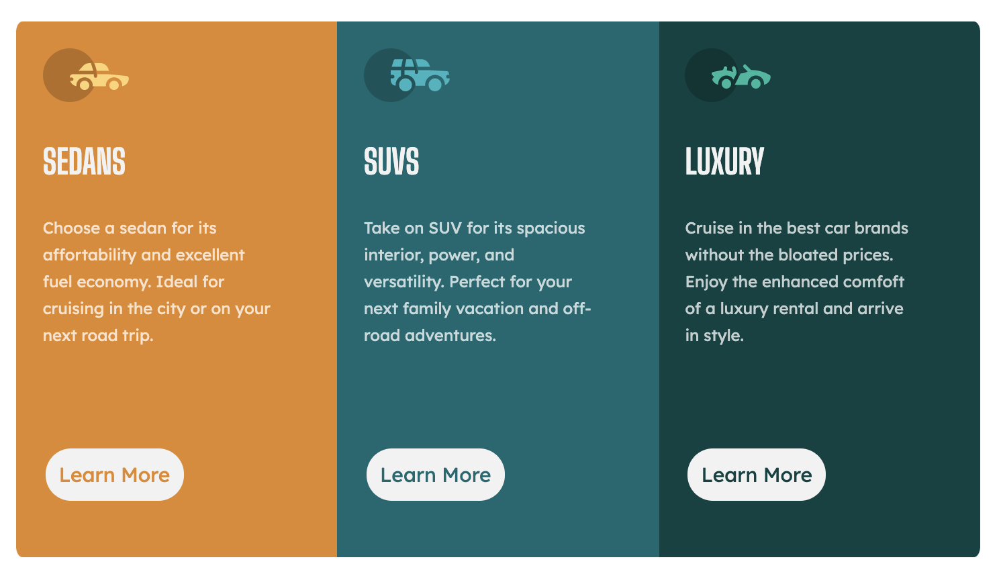

# Frontend Mentor - 3-column preview card component solution

This is my solution to the [3-column preview card component challenge on Frontend Mentor](https://www.frontendmentor.io/challenges/3column-preview-card-component-pH92eAR2-). Frontend Mentor challenges help you improve your coding skills by building realistic projects. 

## Table of contents

- [Overview](#overview)
  - [The challenge](#the-challenge)
  - [Screenshot](#screenshot)

- [Author](#author)

## Overview

### The challenge

Users should be able to:

- View the optimal layout depending on their device's screen size
- See hover states for interactive elements

### Screenshot

## My process

### Built with

- HTML5
- CSS
- Flexbox

### What I learned

I enjoyed creating this and learned more about formating with CSS however am I still need to crack making it availale for mobile.

### Continued development

Whilst I enjoyed this challenge, it has highlighted that I need to learn more about CSS and associated elements in order to be confident.

### Useful resources

- CSS Tricks - (https://css-tricks.com/snippets/css/a-guide-to-flexbox)
- MDN Docs - (https://developer.mozilla.org/en-US/)

## Author

- Frontend Mentor - [@jordapps](https://www.frontendmentor.io/profile/jordapps)
- Twitter - [@jordapps](https://www.twitter.com/@jordapps)
